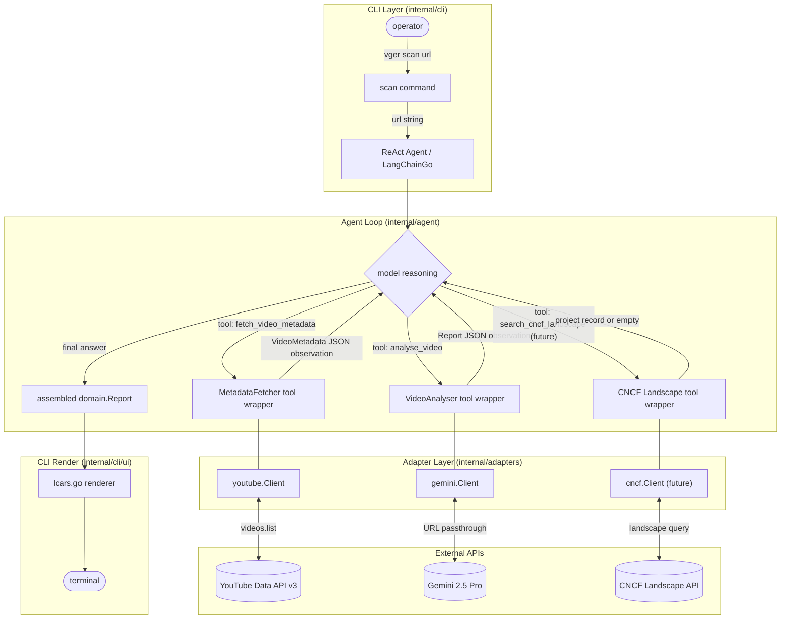
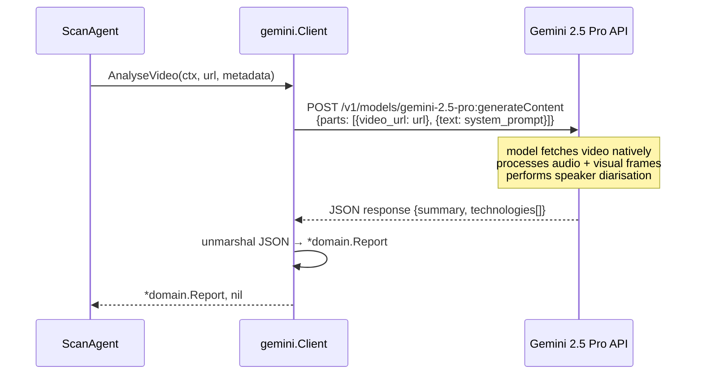

# vger — Analysis Data Flow

---

## 1. Current Pipeline (MVP / Stub)

Sequential execution. The agent layer acts as a coordinator, calling each port in order and passing results downstream. No LLM reasoning drives the sequencing.

---

## 2. Data Types Crossing Layer Boundaries

| Boundary | Type | Direction |
|----------|------|-----------|
| CLI → Agent | `string` (url) | in |
| Agent → MetadataFetcher | `string` (url) | in |
| MetadataFetcher → Agent | `*domain.VideoMetadata` | out |
| Agent → VideoAnalyser | `string` (url), `*domain.VideoMetadata` | in |
| VideoAnalyser → Agent | `*domain.Report` | out |
| Agent → CLI | `*domain.Report` | out |
| CLI → renderer | `*domain.Report` | in |

---

## 3. Planned ReAct Agent Loop

The sequential pipeline in internal/agent/react.go is replaced by a LangChainGo ReAct agent. The agent receives the video URL as its initial input and decides which tools to call, in what order, based on model reasoning. This enables multi-step enrichment (e.g., resolving a technology name against the CNCF Landscape) before the final report is assembled.

---

## 4. Video Analysis Detail (Gemini Adapter)

The Gemini adapter does not download the video. The YouTube URL is passed directly to the Gemini 2.5 Pro multimodal API. The model reads audio, on-screen text (slides, code), and speaker names natively.

