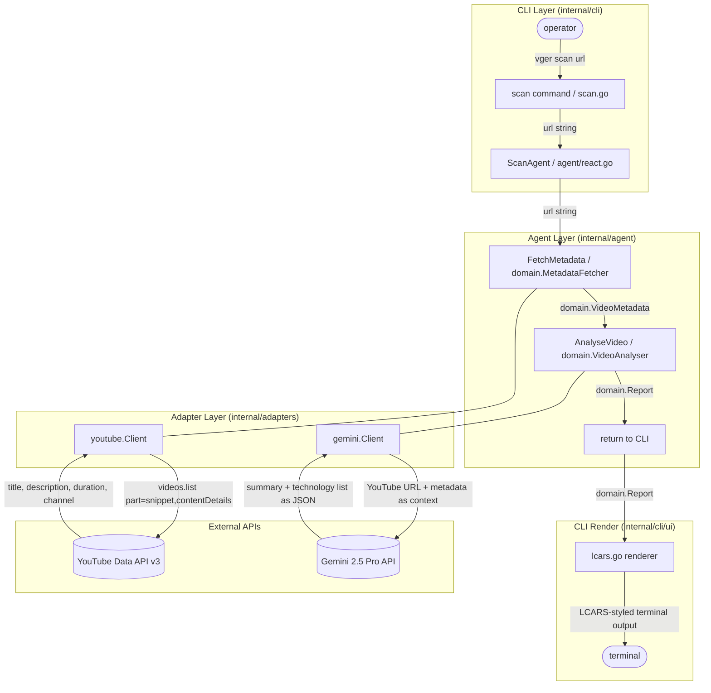
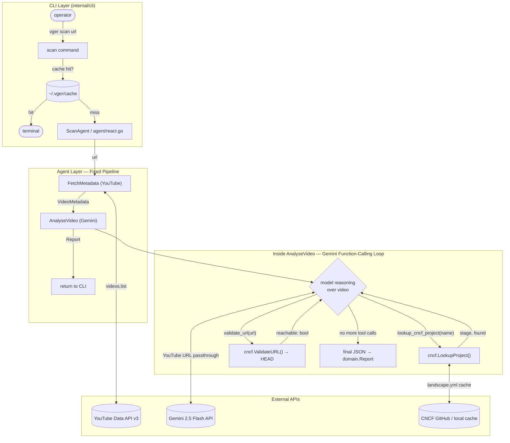
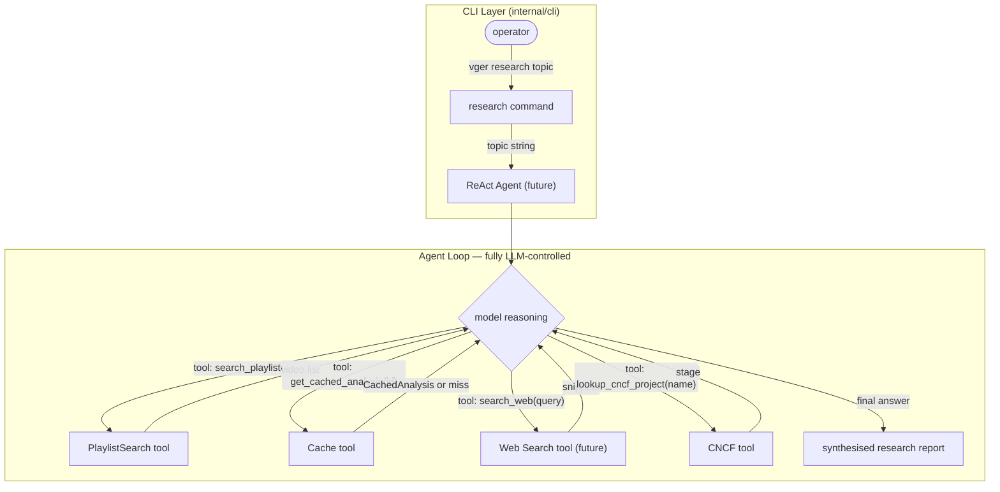
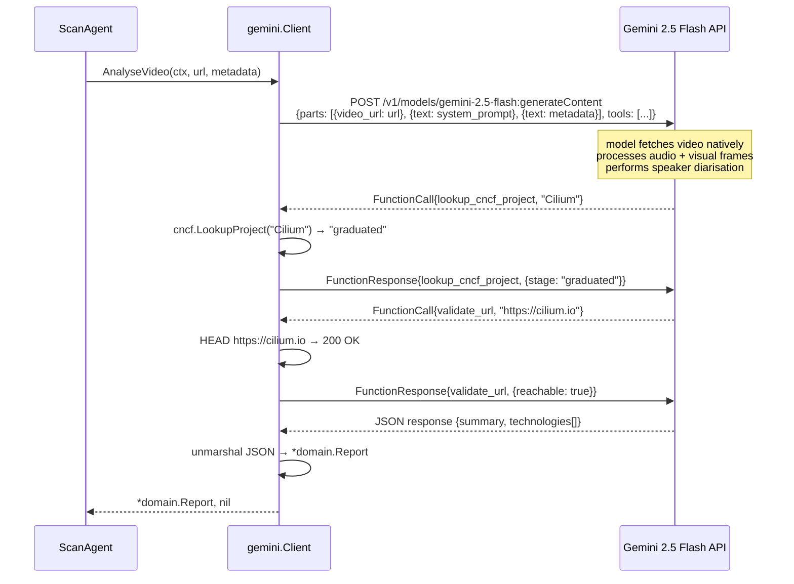

# vger — Analysis Data Flow

---

## 1. Current Pipeline (MVP / Stub)

Sequential execution. The agent layer acts as a coordinator, calling each port in order and passing results downstream. No LLM reasoning drives the sequencing.

---

## 2. Data Types Crossing Layer Boundaries

| Boundary | Type | Direction |
|----------|------|-----------|
| CLI → Agent | `string` (url) | in |
| Agent → MetadataFetcher | `string` (url) | in |
| MetadataFetcher → Agent | `*domain.VideoMetadata` | out |
| Agent → VideoAnalyser | `string` (url), `*domain.VideoMetadata` | in |
| VideoAnalyser → Agent | `*domain.Report` | out |
| Agent → CLI | `*domain.Report` | out |
| CLI → renderer | `*domain.Report` | in |

---

## 3. Implemented: Hybrid ReAct — Go Outer Pipeline + Gemini Tool-Calling Inner Loop

The sequential pipeline is preserved for the deterministic outer steps (metadata fetch, cache
check) that must always run in the same order. Inside `AnalyseVideo`, the Gemini adapter runs
a native function-calling loop where the model controls when to call enrichment tools.

**Why the outer pipeline stays in Go (not LLM-controlled):**
- `FetchMetadata` and `AnalyseVideo` are always required, always sequential — LLM autonomy here adds tokens with zero benefit
- The cache check happens *before* any LLM cost; this would be impossible if the LLM controlled the flow
- `AnalyseVideo` is itself the primary Gemini call — it cannot be a tool call inside another Gemini session

---

## 4. Forward Look: Fully LLM-Controlled ReAct (Future `vger research`)

For a future `vger research <topic>` command, the model would genuinely need to decide
sequencing: which videos to pick, whether to search the web for context, when it has
enough evidence to synthesise. This is the right use case for full LLM autonomy over
the pipeline — unlike single-video scan where the steps are always the same.

**Key tools for this future pattern:**
- `search_playlist(query)` — find relevant videos without pre-selecting them
- `get_cached_analysis(video_id)` — read already-scanned results without re-uploading
- `search_web(query)` — fill gaps for technologies not in training data
- `lookup_cncf_project(name)` — already implemented ✅

---

## 5. Video Analysis Detail (Gemini Adapter)

The Gemini adapter does not download the video. The YouTube URL is passed directly to the Gemini 2.5 Flash multimodal API. The model reads audio, on-screen text (slides, code), and speaker names natively.

