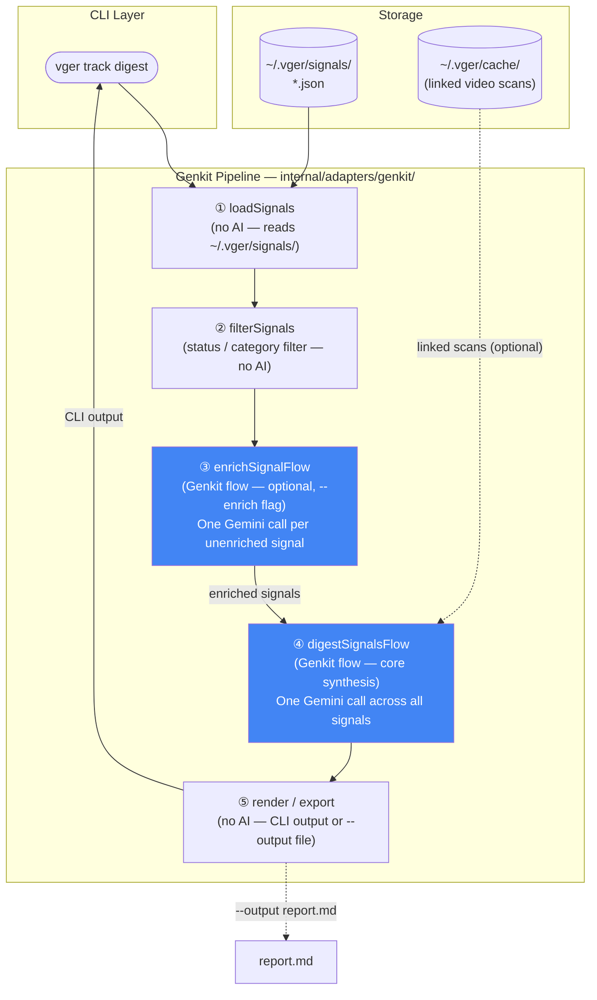
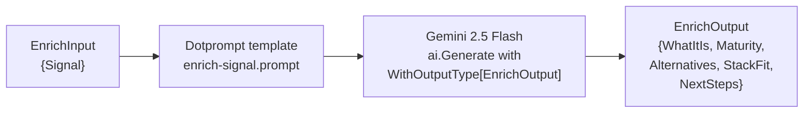
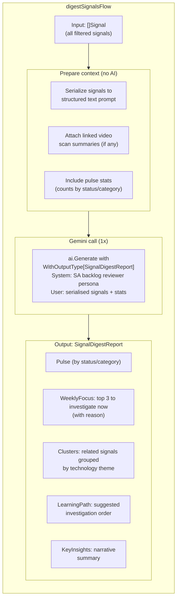
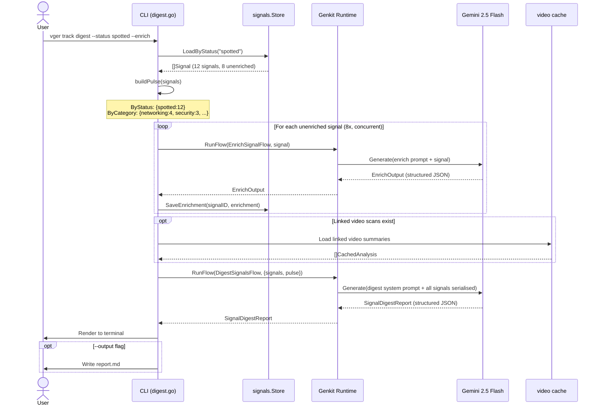

# vger track digest — Design Document

> **Feature:** `vger track digest` — AI-powered backlog review across tracked tech signals  
> **Approach:** Google Genkit Go (typed flows + structured output)  
> **Status:** Design / Pre-implementation

---

## 1. Background

`vger` currently has two layers of intelligence:

| Command | What it does | AI layer |
|---------|-------------|----------|
| `vger scan` | Analyses a conference video, extracts tech radar | Gemini multimodal (per video) |
| `vger digest --playlist ... --ai` | Synthesises across all videos in a playlist | Gemini text (one call, all summaries) |

The planned `vger track` feature adds a **daily signal capture layer**: technologies
and ideas the architect encounters outside of conference videos, stored as structured
JSON records in `~/.vger/signals/`.

`vger track digest` closes the loop — it reads all tracked signals and uses AI to
produce a prioritised backlog review, answering:
> *"Given everything I've flagged, what should I investigate this week, and how do these relate to each other?"*

---

## 2. Why Genkit Go?

vger currently calls `google.golang.org/genai` directly. This works well for
single-shot Gemini calls but creates friction for multi-step pipelines:

| Concern | Direct SDK | Genkit Go |
|---------|-----------|-----------|
| Multi-step pipeline orchestration | Manual state machine | First-class flows |
| Structured output (type-safe) | Manual JSON unmarshal + validation | `ai.WithOutputType[T]()` |
| Prompt iteration | Edit code, rebuild | `genkit start` dev UI, live reload |
| Observability | Hand-rolled | Built-in OTel, flow-level traces |
| Retry / error handling | Manual | Configurable per-flow |
| Testing prompts in isolation | Not possible | Runnable via dev UI |

Genkit wraps the same `google/genai` SDK — migration is additive, not a rewrite.
Existing `vger scan` and `vger digest` can stay as-is; Genkit is introduced only
for the new `vger track` pipeline.

---

## 3. Domain Model Extension

New types added to `internal/domain/model.go`:

```go
// Signal is a technology or idea captured by the architect for later investigation.
type Signal struct {
    ID         string    `json:"id"`          // e.g. "0042"
    Title      string    `json:"title"`
    Date       string    `json:"date"`        // ISO 8601
    Source     string    `json:"source"`      // "Blog post", "Twitter/X", "Colleague"
    URL        string    `json:"url"`
    Category   string    `json:"category"`    // networking | security | platform | ...
    Status     string    `json:"status"`      // spotted | evaluating | adopted | rejected | parked
    Note       string    `json:"note"`        // "Why I captured this"
    Tags       []string  `json:"tags"`
    Enrichment *SignalEnrichment `json:"enrichment,omitempty"` // nil if not yet enriched
    LinkedVideoIDs []string `json:"linked_video_ids,omitempty"` // vger scan links
}

// SignalEnrichment is the AI-filled context added after initial capture.
type SignalEnrichment struct {
    EnrichedAt   string   `json:"enriched_at"`
    WhatItIs     string   `json:"what_it_is"`
    Maturity     string   `json:"maturity"`
    Alternatives []string `json:"alternatives"`
    StackFit     string   `json:"stack_fit"`
    NextSteps    []string `json:"next_steps"`
}

// SignalDigestReport is the output of the vger track digest pipeline.
type SignalDigestReport struct {
    GeneratedAt    string              `json:"generated_at"`
    TotalSignals   int                 `json:"total_signals"`
    Pulse          SignalPulse         `json:"pulse"`
    WeeklyFocus    []FocusItem         `json:"weekly_focus"`   // top 3 to investigate now
    Clusters       []TechCluster       `json:"clusters"`       // related signals grouped
    LearningPath   []string            `json:"learning_path"`  // suggested investigation order
    KeyInsights    string              `json:"key_insights"`
}

// SignalPulse is a breakdown of signals by status and category.
type SignalPulse struct {
    ByStatus   map[string]int `json:"by_status"`   // {"spotted": 12, "evaluating": 4, ...}
    ByCategory map[string]int `json:"by_category"`
}

// FocusItem is a signal recommended for investigation this week.
type FocusItem struct {
    SignalID string `json:"signal_id"`
    Title    string `json:"title"`
    URL      string `json:"url"`
    Reason   string `json:"reason"`  // Why this one, why now
}

// TechCluster is a group of related signals.
type TechCluster struct {
    Theme     string   `json:"theme"`      // e.g. "eBPF-based networking"
    SignalIDs []string `json:"signal_ids"`
    Summary   string   `json:"summary"`    // 1-2 sentences on the common thread
}
```

---

## 4. Genkit Flow Architecture

The pipeline is decomposed into three composable Genkit flows.

### Flow overview



---

### ① Load & Filter (no AI)

```go
// internal/adapters/signals/store.go

func (s *Store) LoadAll(ctx context.Context) ([]*domain.Signal, error)
func (s *Store) LoadByStatus(ctx context.Context, status string) ([]*domain.Signal, error)
func (s *Store) LoadByCategory(ctx context.Context, category string) ([]*domain.Signal, error)
```

Reads `~/.vger/signals/*.json`. Same pattern as the existing cache adapter.
No Gemini call. Zero API cost.

---

### ② enrichSignalFlow (Genkit flow — optional)



```go
// internal/adapters/genkit/enrich.go

type EnrichInput struct {
    Signal domain.Signal `json:"signal"`
}

type EnrichOutput struct {
    WhatItIs     string   `json:"what_it_is"`
    Maturity     string   `json:"maturity"`
    Alternatives []string `json:"alternatives"`
    StackFit     string   `json:"stack_fit"`
    NextSteps    []string `json:"next_steps"`
}

var EnrichSignalFlow = genkit.DefineFlow(g, "enrich-signal",
    func(ctx context.Context, input EnrichInput) (EnrichOutput, error) {
        resp, err := ai.GenerateWithConfig[EnrichOutput](ctx, g,
            ai.WithModel(geminiFlash),
            ai.WithPrompt(buildEnrichPrompt(input.Signal)),
        )
        if err != nil {
            return EnrichOutput{}, err
        }
        return resp.Output, nil
    },
)
```

**When it runs:** Only when `--enrich` flag is passed AND the signal has no
existing `Enrichment`. Already-enriched signals are passed through unchanged.
Runs concurrently across unenriched signals (bounded by a semaphore, like playlist scan).

**Cost:** 1 Gemini call per unenriched signal (~1-2k tokens each).

---

### ③ digestSignalsFlow (Genkit flow — core synthesis)

This is the heart of `vger track digest`. It takes all (possibly enriched) signals
and produces the full `SignalDigestReport` in a single structured Gemini call.



```go
// internal/adapters/genkit/digest.go

type DigestInput struct {
    Signals []domain.Signal `json:"signals"`
    Pulse   domain.SignalPulse `json:"pulse"`
}

var DigestSignalsFlow = genkit.DefineFlow(g, "digest-signals",
    func(ctx context.Context, input DigestInput) (domain.SignalDigestReport, error) {
        prompt := buildDigestPrompt(input)

        resp, err := ai.GenerateWithConfig[domain.SignalDigestReport](ctx, g,
            ai.WithModel(geminiFlash),
            ai.WithSystemPrompt(digestSystemPrompt),
            ai.WithPrompt(prompt),
        )
        if err != nil {
            return domain.SignalDigestReport{}, err
        }
        return resp.Output, nil
    },
)

const digestSystemPrompt = `
You are an experienced solutions architect reviewing your personal technology backlog.
You will be given a list of technology signals — things you have flagged as worth
investigating. Your job is to help the architect get the most value from their limited
investigation time by:

1. Identifying the 3 most important signals to investigate this week (WeeklyFocus),
   with a specific, actionable reason for each.
2. Clustering related signals into technology themes (Clusters) so the architect
   can investigate related ideas together.
3. Suggesting a logical investigation order (LearningPath) if they were to work
   through the backlog systematically.
4. Providing a brief narrative of key insights (KeyInsights) — patterns, trends,
   and connections across the signals.

Be practical and concise. Prioritise based on: maturity, strategic fit for a
cloud-native platform team, and urgency (older spotted signals should be surfaced).
`
```

**Cost:** 1 Gemini call (regardless of number of signals).
Token estimate: ~500 tokens per signal × N signals input + ~2k tokens output.

---

## 5. Full Data Flow — `vger track digest --enrich`



---

## 6. CLI Interface

```bash
# Review all spotted signals — AI synthesis only (no enrichment)
vger track digest

# Enrich unenriched signals first, then digest
vger track digest --enrich

# Filter by status before digesting
vger track digest --status spotted
vger track digest --status evaluating

# Export as markdown
vger track digest --output ~/tech-review-2026-04.md

# Full workflow
vger track digest --status spotted --enrich --output ~/review.md
```

**Flags:**

| Flag | Default | Description |
|------|---------|-------------|
| `--status` | all | Filter signals by status before digesting |
| `--category` | all | Filter signals by category |
| `--enrich` | false | Enrich unenriched signals before synthesis (costs API calls) |
| `--output` | — | Write a Markdown report to a file |

---

## 7. New Files & Integration Points

```
internal/
  domain/
    model.go              ← Add Signal, SignalEnrichment, SignalDigestReport types
    ports.go              ← Add SignalStore port interface

  adapters/
    signals/
      store.go            ← JSON file store for ~/.vger/signals/ (new adapter)
    genkit/
      init.go             ← Genkit initialisation (register model, plugins)
      enrich.go           ← EnrichSignalFlow definition
      digest.go           ← DigestSignalsFlow definition
      prompts.go          ← Prompt builders (buildEnrichPrompt, buildDigestPrompt)

  cli/
    track.go              ← vger track parent command
    track_add.go          ← vger track add (manual or AI-assisted)
    track_list.go         ← vger track list
    track_enrich.go       ← vger track enrich <id>
    track_status.go       ← vger track status <id> <new-status>
    track_digest.go       ← vger track digest (new, uses Genkit flows)

go.mod                    ← Add github.com/firebase/genkit/go
```

---

## 8. Genkit Developer Workflow

One of the key benefits of Genkit: prompts can be iterated in the dev UI
**without rebuilding** the binary.

```bash
# Start Genkit developer UI
genkit start -- go run ./cmd/vger

# Opens http://localhost:4000 — run individual flows with test inputs:
#   - EnrichSignalFlow: paste a signal JSON, see enrichment output
#   - DigestSignalsFlow: paste a list of signals, see digest report
#   - Inspect token counts, latency, and intermediate steps
```

This replaces the current workflow of editing prompts in Go string literals,
rebuilding, and running against live data.

---

## 9. Relationship to Existing `vger digest`

`vger track digest` and `vger digest --playlist ... --ai` are parallel features
serving different data sources:

```
Conference videos ──► vger scan ──► ~/.vger/cache/   ──► vger digest --playlist
                                                              (DigestReport)

Daily signals ───────► vger track add ──► ~/.vger/signals/ ──► vger track digest
                                                                  (SignalDigestReport)
```

They share:
- The same domain package structure
- The same cache/store adapter pattern
- The same CLI styling (lipgloss)

They differ in:
- `vger digest` uses the existing direct `google/genai` SDK (no change needed)
- `vger track digest` introduces Genkit Go for its multi-step pipeline

This is an **additive** introduction of Genkit — the existing commands are unchanged.

---

## 10. Migration Path

If `vger track digest` proves the Genkit model, the existing `vger digest --ai`
synthesis call could be migrated to a Genkit flow in a future iteration:

```
Phase 1 (now):   Introduce Genkit for vger track digest only
Phase 2 (later): Migrate vger digest --ai Synthesise() call to a Genkit flow
Phase 3 (future): Migrate vger scan AnalyseVideo() to a multi-step Genkit flow
                  with tool-calling, CNCF enrichment as a Genkit tool, etc.
```
